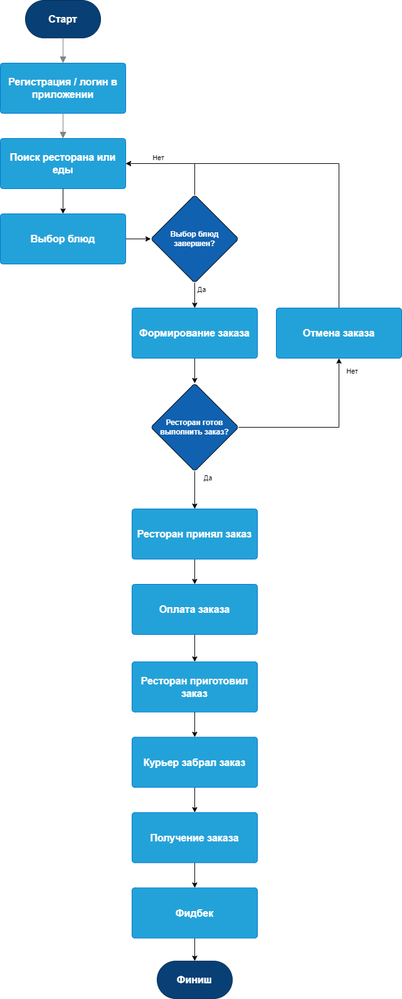
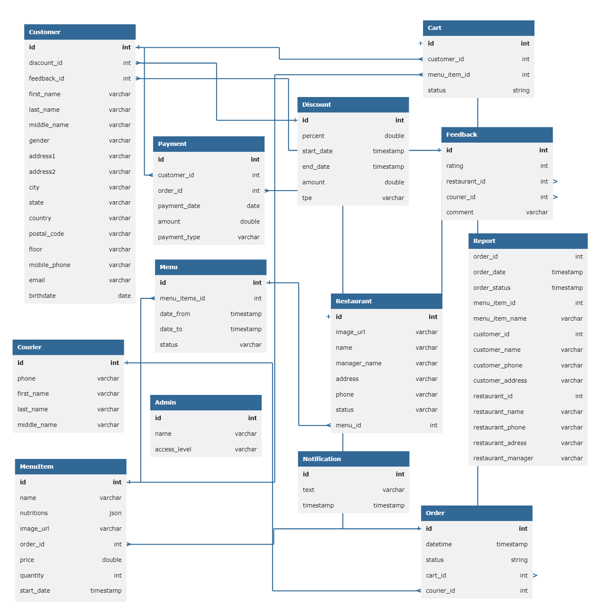

# Food delivery Service System Design

## Table of contents
- [Food delivery Service System Design](#food-delivery-service-system-design)
  - [Table of contents](#table-of-contents)
  - [Introduction](#introduction)
  - [Forecast](#forecast)
  - [Competitors](#competitors)
  - [Goals](#goals)
  - [Stakeholders](#stakeholders)
  - [Assumptions](#assumptions)
  - [Customer journey](#customer-journey)
- [Key requirements (Architectural drivers)](#key-requirements-architectural-drivers)
  - [Solution strategy](#solution-strategy)
    - [Phase №1 “MVP”](#phase-1-mvp)
    - [Phase №2 “Local market”](#phase-2-local-market)
    - [Phase №3 “Global market”](#phase-3-global-market)
  - [Business requirements](#business-requirements)
  - [Capacity Estimates](#capacity-estimates)
  - [Key Architectural Characteristics](#key-architectural-characteristics)
- [Structural context](#structural-context)
  - [Context view](#context-view)
  - [Strategic domain design](#strategic-domain-design)
  - [Container view](#container-view)
  - [Data Model](#data-model)
    - [Understanding the scale of data](#understanding-the-scale-of-data)
- [Technology Stack](#technology-stack)
  - [Mobile applications](#mobile-applications)
  - [Web applications](#web-applications)
  - [Backend](#backend)
  - [External Services](#external-services)
- [Deployment view](#deployment-view)
  - [Deployment diagram](#deployment-diagram)
  - [Description](#description)
- [Security](#security)
    - [Network \& Infrastructure](#network--infrastructure)
    - [Data Protection](#data-protection)
    - [Threat Detection \& Monitoring](#threat-detection--monitoring)
- [Risks](#risks)
  - [Business risks](#business-risks)
  - [Compliance risks](#compliance-risks)
  - [Technical risks](#technical-risks)

## Introduction

В период локдауна услуги по доставке еды мгновенно взлетели до небес. Все стремились получить необходимые продукты и блюда, доставленные к порогу дома. Таким образом, период карантина открыл широкие возможности для бизнеса доставки еды.

Хотя может показаться, что гиганты индустрии контролируют рынок, это не совсем так. Во время пандемии по всему миру стали появляться стартапы по доставке еды по требованию, и они до сих пор набирают популярность.

Glovo, испанский стартап, который сотрудничает предприятиями для доставки еды из ресторанов, продуктов и других товаров, получил финансирование в размере 528 миллионов долларов. Аналогичным образом, Gousto, британский сервис по доставке наборов еды, привлек 41 миллион долларов во время пандемии.

Gorillas, продуктовый стартап, цель которого - доставка товаров за десять минут или меньше, привлек 290 миллионов долларов, превысив первоначальную оценку в 1 миллиард долларов.

Рынок доставки готовой еды и бакалеи начал развиваться в Казахстане около 4 лет назад. На динамику его роста повлияли: 

* появление крупных международных игроков на рынке в 2019 году;
* пандемия Ковид-19, которая изменила покупательские привычки и операционные решения компаний.

Большинство из этих услуг доступны во всех крупных городах Казахстана - Алматы, Астане, Шымкенте, Усть-Каменогорске, Караганде, Таразе и других. В небольших городах службы доставки распространены меньше.

Тренд на доставку в регионах  только зарождается в Казахстане - интернет-магазины и доставка из ресторанов слабо представлены в регионах. И это является точкой роста для рынка.

## Forecast

* Ожидается, что в 2024 году рынок доставки еды в Казахстане будет приносить доход в размере 53,80 млн долларов США.
* Согласно этому прогнозу, совокупный годовой темп роста (CAGR 2024-2028) составит 7,97%, в результате чего к 2028 году объем рынка составит 73,11 млн долларов США.
* Что касается рынка платформ доставки, размер рынка в Казахстане, по прогнозам, достигнет 26,98 млн долларов США в 2024 году.
* Однако, по сравнению с другими странами, наибольший доход ожидается в Китае, где он составит 182 900,00 млн долларов США в том же году.
* Средний доход на одного пользователя (ARPU) на рынке доставки еды в Казахстане составит 32,58 доллара США в 2024 году.
* Ожидается, что к 2028 году количество пользователей на рынке доставки еды достигнет 2,2 миллиона человек.
* С точки зрения проникновения пользователей, рынок доставки еды в Казахстане достигнет 8,4% в 2024 году.
* Несмотря на растущую популярность услуг по доставке еды в Казахстане, традиционная домашняя еда по-прежнему доминирует на рынке.

## Competitors

Сравним крупнейших игроков на казахстанском рынке: Wolt, Glovo, Chocofood и Yandex Food.

**1st place**

_10 заведений назвали эту услугу самой популярной среди своих клиентов._

Рестораны объясняют популярность этого сервиса тем, что он удобнее для их пользователей, чем другие сервисы. Поэтому большинство заведений ставят его на 1-е место в своем личном рейтинге. Стоит также отметить, что стоимость доставки этой службы может быть гораздо дешевле, чем заказ такой же доставки из самого заведения. Услуга GLOVO представлена в 20 из 21 опрошенных заведений.

**2nd place**

_9 заведений назвали этот сервис самым популярным среди своих клиентов._

Слишком маленький отрыв от первого места, что может говорить об похожем удобстве и скорости работы сервиса! А главным преимуществом является бесплатная доставка, которая теперь доступна в сервисе, а также вы можете получить кешбэк в размере 30% при оплате картой VISA. Это очень серьезное преимущество перед конкурентами. Сервис WOLT представлен в 18 из 21 опрошенных заведений.

**3rd place**

_2 ресторана высказались как о самой популярной услуге среди своих клиентов._

Давно известный и любимый многими жителями Алматы, остается в рейтинге довольно высоким, по той причине, что его использование уже стало очень привычным, а в зависимости от района проживания иногда самым интересным и быстрым предложением. Стоимость доставки невысока, а в некоторых местах даже предлагается абсолютно бесплатная доставка при заказе через этот сервис. Услуга Chocofood представлена в 17 из 21 опрошенного заведения.

**4th place**

_Ни один ресторан не назвал эту услугу самой популярной среди своих клиентов._

Даже учитывая популярность этой услуги, к сожалению, она не имеет плюсов и преимуществ для клиентов. Цена за доставку напрямую зависит от расстояния, что также не может радовать. Поэтому на данный момент эта услуга менее популярна. Зато Яндекс может привезти заказ в любую точку, куда вы пожелаете. Это удобно для тех, у кого нет другого выхода. Сервис Яндекс Еда представлен в 13 из 21 опрошенного заведения.

На рынке Казахстана есть и другие менее популярные службы доставки, на которые вы также можете обратить свое внимание, учитывая, что некоторые из них могут быть ближе к вам, а значит, быстрее привезут вам заказ.

## Goals

Мы собираемся запустить онлайн-платформу доставки еды, которая позволит потребителям, ресторанам и службам доставки взаимодействовать в режиме реального времени. Мы должны поддерживать как мобильные приложения для всех клиентов, так и веб-приложение для административных функций. Мы уверены, что станем следующим большим и популярным проектом, и ожидаем значительного и быстрого роста в ближайшие несколько лет.

Мы предполагаем три значимые вехи развития:

1. MVP решение на коленке, чтобы прощупать рынок на одного из регионов Казахстана, собрать команду и отработать основные технологические решения.
2. Масштабировать решения на рынок Казахстана, обеспечить стабильность сервиса и явные конкурентные преимущества.
3. Обеспечить возможности для быстрого выхода на другие рынки.

## Stakeholders

* **SH-1**: Клиент
    * Понятный и простой пользовательский интерфейс
    * Полезные услуги
    * Быстрая и недорогая доставка
    * Большое количество ресторанов и блюд
* **SH-2**: Ресторан
    * Простое в использовании веб-приложение с каталогом блюд
    * Быстрая доставка еды
    * Минимальное количество проблем для клиентов
* **SH-3**: Курьер
    * Простое в использовании мобильное приложение
    * Высокая стоимость доставки
* **SH-4**: Администратор (из нашей компании)
    * Привлечение различных типов клиентов
    * Повышение качество предоставляемых блюд и услуг
    * Открытие новых ниш для развития бизнеса
* **SH-5**: Служба поддержки
    * Легкий доступ к информации о падениях услуг, ошибках и исключительных ситуациях
* **SH-6**: Разработчик
    * Упрощение разработки и поддержки системы
* **SH-7**: Системный администратор
    * Удобные средства мониторинга
    * Удобные средства конфигурирования и масштабирования

## Assumptions

* **ASN-1**: В период между открытием и закрытием ресторана можно есть неограниченное количество еды. Таким образом, нет необходимости проверять количество доступных блюд. Не требуется управление запасами.
* **ASN-2**: У ресторанов нет собственной системы/инфраструктуры онлайн-заказа, все заказы они будут принимать только у нас.
* **ASN-3**: Клиентам будут показаны рестораны в определенном радиусе, скажем, 10 километров.
* **ASN-4**: Клиенты могут заказывать еду только из одного ресторана одновременно в онлайн-заказе. Пункты меню из нескольких ресторанов не могут быть объединены в одном заказе.

## Customer journey

Ниже показано схематичное высокоуровневое описание всего жизненного цикла клиента включая регистрацию всех участников на платформе, формирование заказа, оплату заказа, уведомление ресторана о появлении нового заказа в системе и доставку готовых блюд клиенту.

Жизненный цикл представляет собой следующие шаги:

1. **Регистрация/вход в систему:** Клиенты, рестораны и курьеры могут зарегистрироваться в приложении, указав свои имена, номера телефонов, идентификаторы электронной почты и пароли. Они могут войти в систему, если были зарегистрированы ранее.
2. **Список ресторанов:** Клиентам предлагается список ресторанов, расположенных поблизости от их местонахождения. Они также могут искать конкретные рестораны по различным атрибутам.
3. **Размещение заказа:** Клиенты могут сделать заказ в любом из перечисленных ресторанов, указав адрес доставки.
4. **Обработка платежей:** Клиенты могут оплачивать свои заказы через любой из многочисленных платежных шлюзов приложения.
5. **Уведомление ресторанов:** Ресторан получает уведомления о новом заказе
6. **Назначение заказов курьерам:** Курьеры могут принимать или отклонять отправленные им запросы на доставку еды. В случае принятия они отправляются в рестораны, чтобы забрать заказ для доставки.
7. **Отслеживание заказов:** Клинеты могут отслеживать состояние своего заказа до тех пор, пока он не будет доставлен.
8. **Рейтинги и отзывы:** После получения заказа клиенты могут оценить и просмотреть блюда и услуги доставки.

# Key requirements (Architectural drivers)

## Solution strategy

### Phase №1 “MVP”

Чтобы создать успешную платформу доставки еды, нам нужен надежный план. Ниже приведен перечень шагов для реализации фазы №1.

На этом этапе мы должны исследовать рынок, определиться с бизнес-моделью и функциями частей нашей платформы доставки еды и разработать достаточный объем кода для запуска MVP на небольшом локальном рынке.

**Шаг 1. Исследование рынка**

Необходимо тщательно изучить, что нравится клиентам, какие тенденции наблюдаются в отрасли и кто является нашим конкурентом. Найдите пробелы на рынке и воспользуйтесь этими возможностями. Это поможет нам лучше понять целевую аудиторию и выделить ваше приложение в индустрии доставки еды.

**Шаг 2. Определить уникальные преимущества нашего приложения**

Определить, что отличает наше приложение для доставки еды от существующих конкурентов. Сосредоточиться на решении конкретных проблем клиентов, таких как более быстрая доставка, разнообразные фильтры приложения или более удобный интерфейс.

**Шаг 3. Выбор бизнес-модель**

Перед началом разработки приложения для доставки еды необходимо выбрать бизнес-модель, которая соответствует нашим целям и целевой аудитории. Мы можем выбрать такие варианты, как партнерство с ресторанами или, например, готовое решение для них.

**Шаг 4. Выбрать подход как мы будем осуществлять разработку системы**

Лучше всего осуществлять разработку ключевых доменов решения собственными силами и отдать supportive и general домены на подряд надежной компании с опытом разработки, либо использовать проверенные временем продукты. 

**Шаг 5. Определиться с функциями приложения**

Изучив рынок, нужно определить, что делает наше приложение особенным. Возможно, у нас уже есть идея идеального приложения для доставки еды, но необходимо последовательно изучать рынок и выявлять наиболее ценные свойства решения за которые клиенты будут платить. 

**Шаг 6. Выбрать технологический стек**

Необходимо выбрать подходящий технологический стек, включая платформу (iOS, Android или обе), инфраструктуру бэкенда и управление базами данных. Выбор в том числе зависит от имеющихся у нашей команды компетенций.

**Шаг 7. Дизайн и разработка приложения**

Необходимо создать интуитивно понятный и удобный дизайн приложения. Не стоит забывать о пользовательском опыте, чтобы сделать приложение для доставки еды простым в использовании.

**Шаг 8. Безопасная интеграция платежей**

Необходимо использовать надежные средства защиты для обработки платежей, чтобы обеспечить безопасность данных пользователей. Это защитит пользователей и повысит доверие к вашему приложению для доставки еды.

### Phase №2 “Local market”

Чтобы создать успешную платформу доставки еды, нам нужен надежный план. Ниже приведен список шагов Фазы №2 проекта.

На этом этапе мы уже определились с бизнес-моделью и функциями нашей платформы запустили MVP на небольшом локальном рынке. Далее необходимо составить конкуренцию во всех крупнейших городах страны и начать захватывать региональный рынок. Для этого необходимо 

**Шаг 1. Определить состав технического долга**

Необходимо посмотреть на бэклог задач, которые описывают блоки функционала требующие рефакторинга. Далее необходимо оценить необходимый объем ресурсов для устранения технического долга.

**Шаг 2. Тестирование приложения для масштабирования**

Обязательно нужно потратить ресурсы на покрытие важных частей кода автотестами и на тщательное тестирование приложения, чтобы команда разработчиков могла выявить и устранить любые ошибки или проблемы. Тестирование включает в себя проверку работоспособности всех функций, обеспечение правильного ввода и вывода данных, совместимость с различными устройствами и операционными системами. Кроме того, необходимо выделить ресурсы на проведение нагрузочного тестирования.

**Шаг 3. Актуализировать архитектурные решения**

На данном шаге наша система представляет собой неоптимальное с точки зрения архитектуры решения. На предыдущем этапе у команды разработки не было задачи обеспечить возможность кратного роста количества пользователей платформы, обеспечение максимальной безопасности данных и возможности масштабирования разработки и удобной интеграции с партнерами. 

**Шаг 4. Обеспечение гибкости разработки**

Кодовая база платформы на этом шаге может значительно вырасти, появится несколько независимых команд, причем возможно команды будут использовать отличный от основного технический стек. Необходимо обеспечить поддержку возможности независимой разработки, интеграции и деплоя своих фич для каждой команды.

**Шаг 5. Документирование решения**

На данном шаге наша система не покрыта нормальной документацией, поскольку для стадии MVP в этом нет острой необходимости. Команда небольшая и кодовая база также понятна. На втором шаге возможно масштабирование команды и подключение партнеров и сторонних команд к проекту, поэтому хорошая документация становится необходимым условием работы.

### Phase №3 “Global market”

Чтобы создать успешную платформу доставки еды, нам нужен надежный план. Ниже приведен список шагов Фазы №3 проекта.

На этом этапе необходимо подготовить разработанную платформу для ввода в эксплуатацию за пределами локального рынка. На данном шаге значительно повышаются требования к локализации решения, простоте эксплуатации и развертывания в публичном облаке. Также необходимо учитывать особенности каждого рынка с точки зрения законодательства, национальных традиций и использования данных.

**Шаг 1. Актуализировать архитектурные решения**

Определить ключевые архитектурные характеристики решения для глобального рынка доставки еды.

**Шаг 2. Мультиязычность и локализация**

Нужна поддержка нескольких языков. Это включает в себя интернационализацию наших мобильных и веб приложений, чтобы они могли поддерживать новые языки, а также локализацию контента и интерфейса под нужды конкретных рынков.

**Шаг 3. Мультивалютность**

Необходимо обеспечить поддержку различных валют для обработки платежей и отображения цен для нашей платформы. 

**Шаг 4. Глобальная доступность и производительность**

Требуется перевести инфраструктуру в облако, которое обеспечит высокую доступность и производительность вашей платформы для пользователей из разных стран. Необходимо обеспечить мультизональность в облаке, чтобы уменьшить задержки и обеспечить быструю загрузку страниц.

**Шаг 5. Безопасность и конфиденциальность данных**

Платформа доставки еды должна соответствовать международным стандартам безопасности данных, например таким как GDPR для стран Европейского Союза или CCPA для Калифорнии. Нужно обеспечить защиту конфиденциальности данных пользователей и соответствие местным законам о защите данных.

**Шаг 6. Географическое распределение данных**

Необходимо использовать географически распределенных баз данных или CDN (сети доставки контента) для обеспечения быстрого доступа к данным для пользователей из разных стран.

## Business requirements

Мы собрали все обязательные функции, которыми должно обладать приложение для доставки еды для клиентов, владельцев ресторанов и водителей. Давайте разберемся.

Клиенты:

* **FR-1**: Поиск ближайших ресторанов на основе местоположения пользователя. Пользователи также могут посмотреть меню, цены, отзывы и заказать еду из ресторана.
* **FR-2**: Создание корзины, добавление в нее блюд из меню и формирование заказа.
* **FR-3**: Получение уведомлений о статусе заказа после его оформления
* **FR-4**: Отслеживание  статуса заказа в приложении
* **FR-5**: Проверка, сколько времени потребуется курьеру на доставку
* **FR-6**: Отмена заказа
* **FR-7**: Осуществление онлайн-платежа с помощью дебетовых/кредитных карт, интернет-банкинга и т.д.. С другой стороны, рестораны могут легко получить деньги через интеграцию с платежными шлюзами, такими как Kaspi, Stripe и т. д.
* **FR-8**: Оценка приложения или услуги, чтобы администраторы могли решить проблемы и повысить уровень сервиса
* **FR-9**: Возможность клиенту управлять и просматривать свои прошлые заказы. И возможность повторить предыдущие заказы, когда это необходимо
* **FR-10**: Создание/обновление учетной записи и контактной информации

Рестораны:

* **FR-11**: Создание профиля (onboarding) и создание/обновление/добавление новых пунктов меню, фотографий, цен и наличия
* **FR-12**: Получение уведомлений о размещенных заказах, назначенных водителях, актуальном статусе заказа и т. д.
* **FR-13**: Управление оплатой и комиссионными за каждый заказ еды
* **FR-14**: Offboarding: Если ресторан выходит из бизнеса или решает прекратить прием онлайн-заказов

Курьеры:

* **FR-15**: Регистрация и авторизация в приложении, используя номера телефонов, различные социальные сети. Вся процедура регистрации или входа должна быть простой, чтобы новые участники могли легко зарегистрироваться.
* **FR-16**: Загрузка личной информации в профиль, такой как имя, адрес электронной почты, контактные данные, фотография и других данных. 
* **FR-17**: Оповещение курьеров о новых заказах, которые были назначены. Когда водители не используют приложение для доставки, они должны получать звуковое оповещение о заказах, которые были запрошены.
* **FR-18**: Обработка и реагирование на различные запросы для доставки еды. Курьеры могут принимать любые заявки, которые находятся недалеко от другого места доставки.
* **FR-19**: Интеграция с картами GPS.
* **FR-20**: Управление оплатой и комиссионными для каждого заказа еды.
* **FR-21**: Информация, когда заказ доступен для доставки.
* **FR-22**: Информирование клиента и ресторан о любых проблемах, возникающих при выполнении заказа.
* **FR-23**: Если у клиента возникла проблема, курьер может воспользоваться чатом или звонком, чтобы связаться с ним и позвонить.
* **FR-24**: Возможность просмотреть историю заказов на доставку еды и записи об оплате.
* **FR-25**: Возможность расторгнуть контракт и прекратить оказывать услугу

Администраторы:

* **FR-26**: Каждое действие, выполняемое клиентами или курьерами в приложении для доставки еды, может контролироваться администратором. Приборная панель администратора позволяет отслеживать доставку еды, курьеров и запланированные/отмененные заказы, а также получать доступ к информации о курьерах.
* **FR-27**: Администратор может управлять всем: от получения посылок с едой до доставки и запланированных заказов. Администраторы отвечают за упрощение заказов и их доставку клиентам в определенное время.
* **FR-28**: Обновления и уведомления в реальном времени о курьерах и владельцах ресторанов, например, обновление их профиля, расписания работы ресторанов и доступности.
* **FR-29**: Позволяет администратору предлагать различные скидки и коды купонов в приложении.
* **FR-30**: Оповещения и уведомления о том, что курьер принял заявку на заказ и направляется на сбор/доставку посылок.
* **FR-31**: Возможность администратору добавлять и удалять рестораны из приложения.
* **FR-32**: Возможность запускать и управлять различными кампанииями по электронной почте, SMS и в социальных сетях.

## Capacity Estimates

Ниже перечислены глобальные ограничения для решения, которые определяют все компромиссные решения:

* **NFR-A1**: Потенциальные клиенты службы доставки еды - около 2000
* **NFR-A2**: Активные пользователи сервиса в Казахстане - около 200
* **NFR-A3**: Предположим, мы пока обслуживаем пользователей в 1 локальном регионе
* **NFR-A4**: Запускаем сервис на 200 ресторанов
* **NFR-A5**: В каждом ресторане может быть 30 блюд, которые могут быть поданы.
* **NFR-A6**: Общее количество блюд = 200 * 30 = 6K
* **NFR-A7**: Общее количество агентов доставки: 20
* **NFR-A8**: Средний чек - 4500 тенге
* **NFR-A9**: Если каждый клиент в среднем делает 2 заказа в день, то количество заказов в день = 400
* **NFR-A10**: Доступность системы должна составлять не менее 95%
* **NFR-A11**: Разработку осуществляет одна команда

## Key Architectural Characteristics

Ключевые архитектурные характеристики, которые были определены на этапе разработки MVP, помогают нам выбрать общий архитектурный стиль. Три наиболее важные характеристики выделены жирным шрифтом:

* Agility
* Scalability
* Availability +
* Performance
* Interoperability
* Usability +
* Reusability
* Maintainability
* **Modularity ++**
* Data Integrity
* Security +
* **Cost ++**
* Configurability
* Fault Tolerance
* **Simplicity ++**

Выделенные выше ключевые архитектурные характеристики позволяют определить наиболее подходящий архитектурный стиль на данном этапе.

# Structural context

## Context view

Ниже показан концептуальный дизайн системы Food Delivery. Более подробную информацию о C4 Model  можно найти в официальной документации.

Цель разработки диаграммы на уровне контекста - показать область применения разработанной программной системы (показана в центре) и указать, с какими внешними объектами взаимодействует система.

В ходе нескольких сессий Event Storming были выявлены основные домены разрабатываемой системы.  Event Storming - это гибкий формат семинара, который позволяет командам совместно исследовать сложные бизнес-области. Он особенно эффективен для объединения заинтересованных сторон с разным опытом и специализацией. Методология может быть адаптирована к различным сценариям.

Выявленные субдомены разрабатываемой системы включают:

* Core domain
    * Delivery service
    * Restaurant service
    * Customer service
    * Administration service
    * Order service
* Supportive domain
    * Accounting service
    * Feedback service
* Generic domain
    * Reporting service
    * Payment service
    * Notification service
    * Auth service

На рисунке ниже представлено наше видение доменной структуры решения.

## Strategic domain design

На рисунке ниже представлено видение классификации основных, поддерживающих и общих доменов.

**Core domain**

Обеспечивает уникальность бизнеса и самые важные бизнес-процессы. В нашем случае это:

* Delivery service
    * Наполнение профиля курьера
    * Управление доставкой заказов
* Restaurant service
    * Управление меню ресторана и другой информацией, включая местоположение и часы работы
    * Просмотр заказа в ресторане (управление приготовлением заказов на кухне ресторана)
* Customer service
    * Онбоардинг клиента
    * Управление информацией о клиентах
    * Представление заказа клиентом (управление инвариантами заказа и клиента, например, лимитами заказа)
* Administration service
    * Управление информацией о клиентах
    * Мониторинг всех событий связанных с клиентами, ресторанами и курьерами
* Order service
    * Управление заказами и выполнением заказов

**Supportive subdomain**

Значимо для бизнеса, но могут быть использованы сторонние программные продукты при соответствующей настройке и интеграции. В нашем случае это:

* Feedback service
    * Система должна быть легко расширяемой и может включать механизмы опроса других производителей. 
    * Модуль предоставляет удобный способ управления каналами обратной связи.
* Accounting service
    * Учет потребителей - управление выставлением счетов потребителям
    * Бухгалтерия ресторана - управление платежами ресторанам
    * Учет курьеров - управление платежами курьерам

**Generic subdomain**

Для модулей, которые попадают в эту категорию, не требуется никакой или незначительной доработки - все потребности покрываются другими программными продуктами, доступными на рынке.

* Reporting service - нет необходимости внедрять собственный механизм создания отчетов, поскольку многие специализированные продукты могут создавать все необходимые отчеты на основе предоставленных данных.
* Payment service - мы лишь создадим шлюз для платежных систем или даже выберем платежного провайдера, который будет осуществлять все специфические коммуникации с платежными системами.
* Notification service - лучше использовать готовые сервисы, которые их предоставляют, чтобы сэкономить время и деньги.
* Auth service - можно точно использовать готовые проверенные решения для аутентификации и авторизации

## Container view

Диаграмма Container показывает элементы внутри системы Food Delivery Platform и то, как они связаны друг с другом, а также с акторами и внешними системами. Домены внутри системы далее разбиваются на диаграммы компонентов на следующем уровне. Диаграмма контейнеров скрывает детали реализации, чтобы увидеть общую картину.

Здесь у нас есть модульный монолит, спроектированный с учетом доменной структуры и и PostgreSQL в качестве базы данных. Это самый простой дизайн системы, который только можно придумать для такого типа приложений.

На текущем этапе данный архитектурный стиль полностью удовлетворяет потребностям бизнеса. Он обеспечивает быструю разработку, простое обслуживание. Также, он учитывает, что команда разработки на данном этапе не превышает 10ти участников.

## Data Model

Выбор базы данных обычно зависит от объема хранимых данных, удобства масштабирования, степени структурированности данных, удобства репликации и ряда других факторов. В соответствии с требованиями ACID (Atomicity, Consistency, Isolation, Durability) на данном этапе реляционная база данных предпочтительнее NoSQL-аналога. Мы можем на старте хранить неструктурированные объекты в реляционной БД в виде JSON. При повышении объемов хранимой информации и декомпозиции монолита на микросервисы, можно пересмотреть данный подход.

Базы данных обычно получают больше запросов на чтение, чем на запись. Реплика чтения - это копия основной базы данных, используемая специально для обработки запросов на чтение.

[https://databasediagram.com/app](https://databasediagram.com/app)

### Understanding the scale of data

Чтобы проектирование системы было эффективным, нам нужно знать, с каким объемом данных мы работаем.

В соответствии с указанными требованиями в разделе “Quality attributes and scenarios” мы имеем следующие цифры на фазе MVP:

* Потенциальные клиенты службы доставки еды - около 2000
* Активные пользователи сервиса в Казахстане - около 300
* Всего 200 ресторанов
* В каждом ресторане может быть 30 блюд
* Общее количество блюд = 200 * 30 = 6K
* Общее количество агентов доставки: 20
* Количество заказов в день = 400

Предположим, что на данном этапе в нашу платформу доставки еды ежемесячно будет добавляться 10 новых ресторанов и 100 новых клиентов. Соответственно, можно рассчитывать на 10*30 новых блюд в месяц.

Предположим, что информацию о ресторанах, курьерах и клиентах и заказах необходимо хранить не менее 3 лет.

Примерный объем хранимой информации в первый год будет следующим:

* Профили клиентов, курьеров и менеджеров ресторанов: 1176 MiB
* Данные о ресторанах и меню: 1465 MiB
* Данные о блюдах: 2350 MiB
* Данные о курьерах: 11 MiB
* Данные о заказах: 324 MiB
* Данные нотификаций: 178 МiБ
* Данные для аналитики: 263 MiB
* Итого: 12.5 GiB
* **plus** Репликация данных 2х: 37.5 GiB

Примерный объем хранимой информации за 3 лет: 37.5 GiB + 10% = 118 GiB

# Technology Stack

## Mobile applications

<table>
  <tr>
   <td><strong>Topic</strong>
   </td>
   <td><strong>Android</strong>
   </td>
   <td><strong>iOS</strong>
   </td>
  </tr>
  <tr>
   <td>Programming Languages
   </td>
   <td>Java, Kotlin
   </td>
   <td>Swift, Objective-C
   </td>
  </tr>
  <tr>
   <td>Toolkit
   </td>
   <td>Android Studio, Android Developer Tools
   </td>
   <td>Apple Xcode
   </td>
  </tr>
  <tr>
   <td>SDK
   </td>
   <td>Android SDK
   </td>
   <td>iOS SDK
   </td>
  </tr>
</table>

## Web applications

<table>
  <tr>
   <td><strong>Topic</strong>
   </td>
   <td><strong>Technology</strong>
   </td>
  </tr>
  <tr>
   <td>Programming Languages
   </td>
   <td>Typescript
   </td>
  </tr>
  <tr>
   <td>Library or Framework
   </td>
   <td>React, Redux

Next
   </td>
  </tr>
</table>

## Backend

<table>
  <tr>
   <td><strong>Topic</strong>
   </td>
   <td><strong>Technology</strong>
   </td>
  </tr>
  <tr>
   <td>Programming Languages and frameworks
   </td>
   <td>Java, Spring
   </td>
  </tr>
  <tr>
   <td>Virtualization platform
   </td>
   <td>VMware
   </td>
  </tr>
  <tr>
   <td>Relational data store
   </td>
   <td>PostgreSQL
   </td>
  </tr>
  <tr>
   <td>Monitoring
   </td>
   <td>Prometheus, Grafana
   </td>
  </tr>
  <tr>
   <td>Logging
   </td>
   <td>FluentD, ElasticSearch, Kibana
   </td>
  </tr>
  <tr>
   <td>Ci/CD
   </td>
   <td>Gitlab
   </td>
  </tr>
</table>

## External Services

<table>
  <tr>
   <td><strong>Topic</strong>
   </td>
   <td><strong>Services</strong>
   </td>
   <td><strong>Integration type</strong>
   </td>
  </tr>
  <tr>
   <td>Mailing Services
   </td>
   <td>MailGun,Firebase Cloud Messaging
   </td>
   <td>REST, JSON
   </td>
  </tr>
  <tr>
   <td>Push Notifications
   </td>
   <td>Apple Push Notifications Service (APN), Firebase Cloud Messaging (FCM)
   </td>
   <td>REST, JSON
   </td>
  </tr>
  <tr>
   <td>Payments
   </td>
   <td>Stripe,Google Pay, Apple Pay, Kaspi Pay
   </td>
   <td>REST, JSON
   </td>
  </tr>
  <tr>
   <td>Location Tracking
   </td>
   <td>MapKit for iOS

Yandex Maps

2Gis
   </td>
   <td>REST, JSON
   </td>
  </tr>
</table>

# Deployment view

## Deployment diagram

## Description

На этапе MVP используется средства виртуализации на базе VMWare, поскольку Backend представляет собой модульный монолит и нет потребности в оркестрации контейнеров в K8S.

Отказоустойчивость системы реализована за счет использования резервной копии системы на кластере виртуальных машин VM.PROD2.

Переключение на рабочую ноду обеспечивается за счет использования балансировщика на базе NGINX.

# Security

Администраторы могут получить доступ к данным кредитных карт клиентов. Необходимо предотвратить это, выделив биллинг в отдельный архитектурный квант и изолировав его в отдельной сетевой зоне со строгими разрешениями на доступ.

То же самое касается и службы поддержки клиентов - мы не хотим, чтобы злоумышленник получил доступ к перезагрузке системы. Значительным улучшением безопасности будет перенос клиентских сервисов и данных в отдельный сегмент и изоляция его в отдельной сетевой зоне.

Существует множество аспектов безопасности, которые необходимо учитывать, включая аутентификацию и авторизацию. Ниже приведен обзор соображений безопасности для решения, которое будет разработано.

### Network & Infrastructure

Для сетевого трафика можно применять тонкие политики безопасности, что особенно важно при взаимодействии с другими системами. В рамках платформы мы можем их использовать для создания Zero Trust инфраструктуры, которая поможет защититься от злоумышленников, которые потенциально могли бы обойти систему аутентификации.

Необходимо использовать сервисы:

* Защита от DDoS-атак
* Брандмауэр веб-приложений - фильтрация вредоносного трафика и обеспечение нулевого доверия

### Data Protection

Необходимо использовать механизмы шифрования и управления ключами, что позволяет обеспечить дополнительный уровень защиты данных и не хранить секретные данные в коде.

Данные будут зашифрованы в состоянии хранения (например, в базе данных) и при передаче (внутри системы, а также при входе в систему и выходе из нее) с использованием надлежащего надежного шифрования.

Пароли будут храниться только в виде хэшей, а политика в отношении длины и сложности будет соответствовать современной практике (например, 10+ символов, не менее 256 символов, не нужно включать определенные типы символов, проверять списки взломанных/обычных паролей, не нужно менять каждые x месяцев и т. д.).

Используемые технологии:

* HTTPS/SSL - TLS для обеспечения безопасности соединения. Все коммуникации между веб- или мобильными клиентами должны осуществляться по TLS.
* OAuth 2.0 для авторизации/обновления/генерации токенов.

Используемые службы:

* Key Management Service - хранение и управление ключами шифрования
* Certificate Manager - управление публичными и частными сертификатами SSL/TLS
* Secrets Manager - управление, ротация и извлечение секретов

### Threat Detection & Monitoring

Необходимо обеспечить непрерывный мониторинг сетевой активности и поведения учетных записей/пользователей, чтобы выявлять угрозы при первой же возможности.

Используемые решения:

* Системы управления информационной безопасностью (SIEM): собирают, агрегируют, анализируют и отображают данные о безопасности из различных источников, таких как журналы событий, сетевые устройства, конечные точки и т. д. Эти системы могут обнаруживать аномалии, атаки и другие потенциальные угрозы на основе анализа больших объемов данных.
* Системы обнаружения вторжений (IDS/IPS): контролируют сетевой трафик и обнаруживают атаки, аномальные попытки доступа и другие угрозы. Они могут быть развернуты как на периметре сети, так и внутри сетевой инфраструктуры для защиты различных уровней сетевой архитектуры.
* Ведение журнала и отслеживание активности
* Восстановление после сбоев или вредоносных атак

# Risks

Это возможные деловые и технические риски, которые мы постарались осветить ниже.

## Business risks

* **BR-1:** Существуют достаточно сильные конкуренты на рынке. Они уже утвердили свои ниши и у них достаточно много лояльных клиентов.
* **BR-2:** Не каждый наш клиент может себе позволить доставку готовой еды каждый день. Нужно понять, какой стоимость доставки и какими блюдами мы можем привлечь максимальное количество клиентов.
* **BR-3:** Бездомные и малообеспеченные люди не смогут воспользоваться системой.
* **BR-4:** Возможны проблемы с качеством пищи в ресторанах. Нужно подключить юристов, чтобы минимизировать связанные с этим риски.
* **BR-5:** Люди могут воспринять новый сервис негативно и запустить антирекламу в социальных сетях.

## Compliance risks

* **CR-1:** Проблемы с качеством пищи предлагаемой на платформе могут нанести ощутимый вред здоровью части абонентов.
* **CR-2:** Возможная утечка личной информации из профиля клиента (см. раздел "ADR-2 Security").
* **TR-3:** При увеличении числа пользователей возможно появление различного рода фродовых операций, которые сложно выявить.

## Technical risks

* **TR-1:** Риск значительного увеличения нагрузки на систему во время некоторых маркетинговых кампаний. Это связано с тем, что мы не можем предсказать количество регистраций. 
* **TR-2:** Реализовать на старте проекта качественные мобильные и веб-приложения может быть довольно сложно. Требуется тщательное тестирование и отладка.
* **TR-3:** Злоумышленники могут взломать нашу систему и украсть конфиденциальные данные (см. раздел "ADR-2 Security").